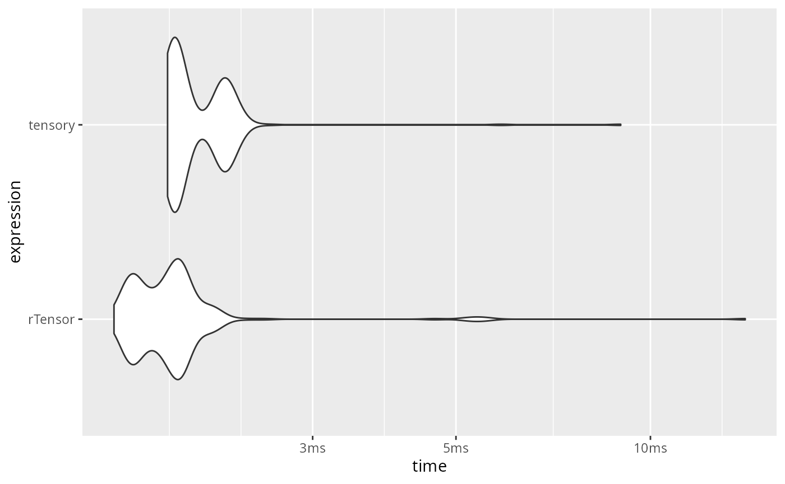
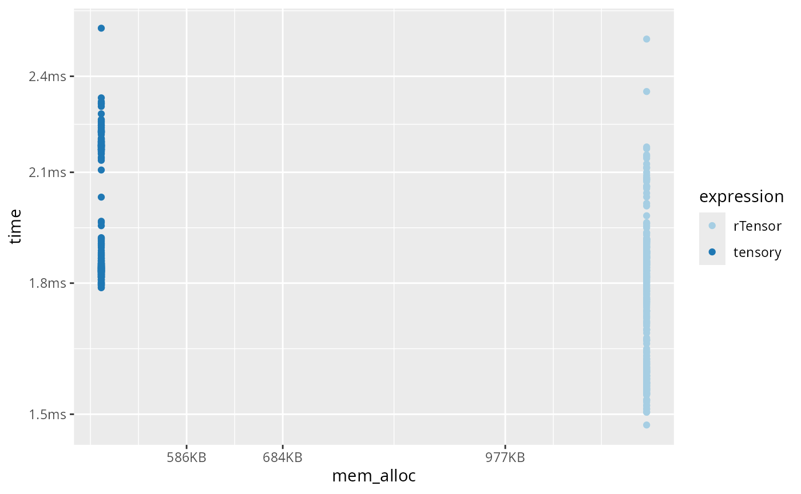
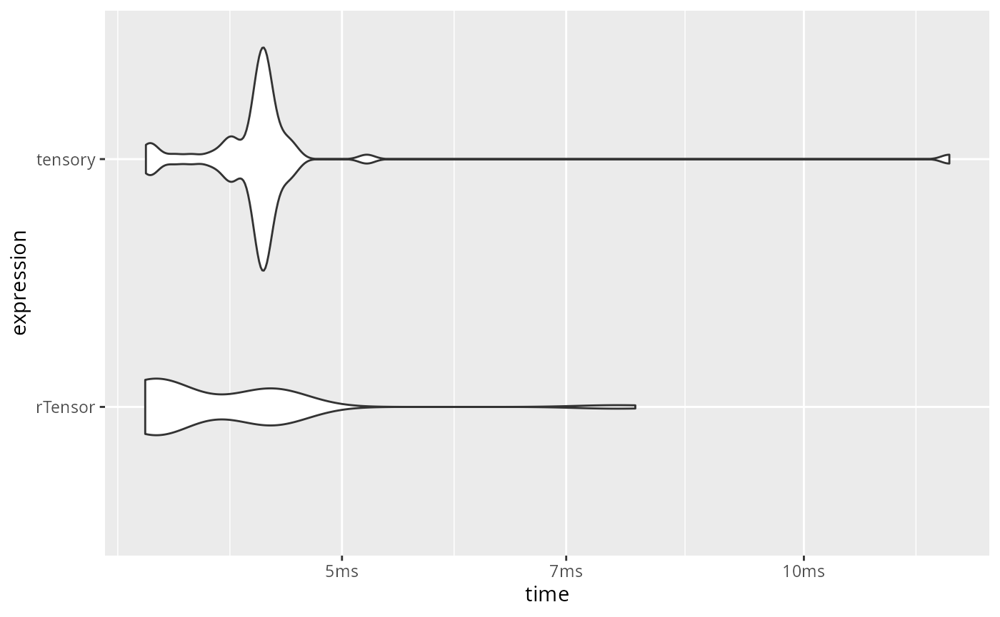
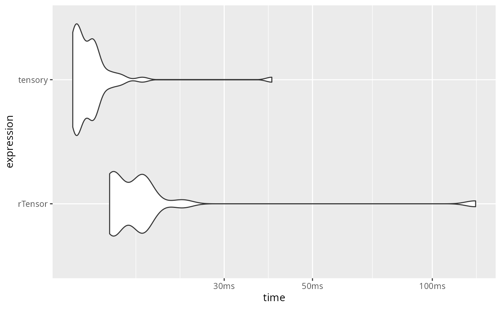
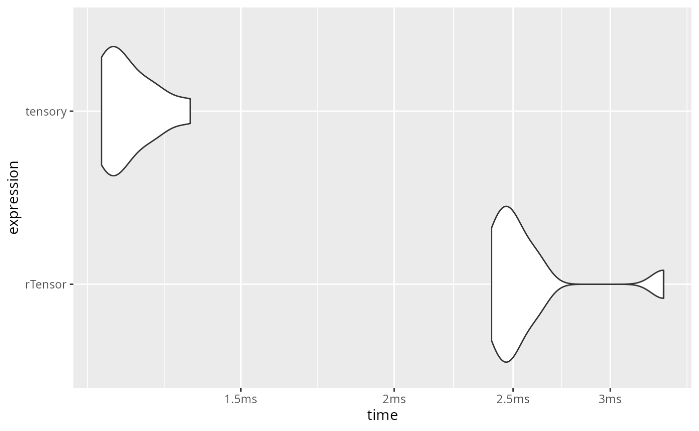
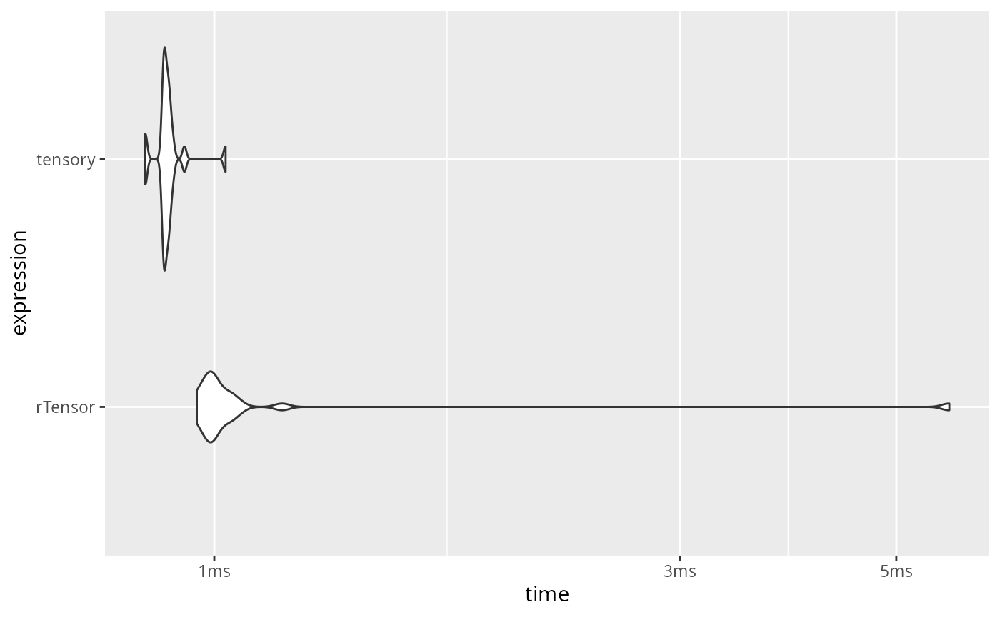
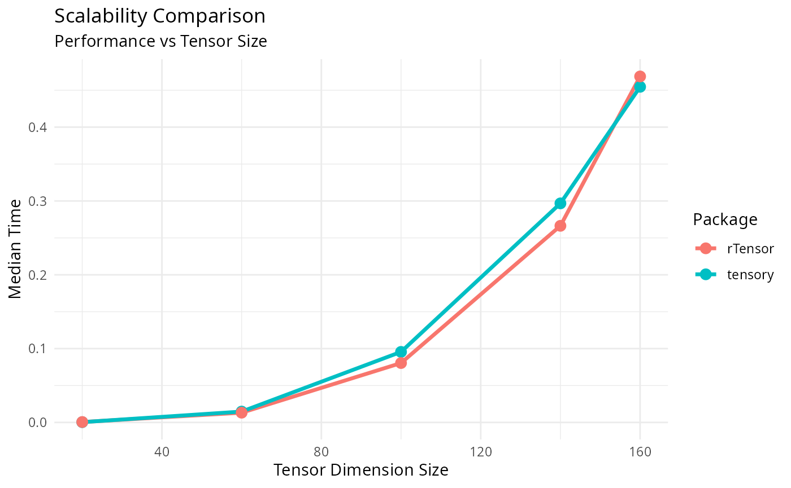
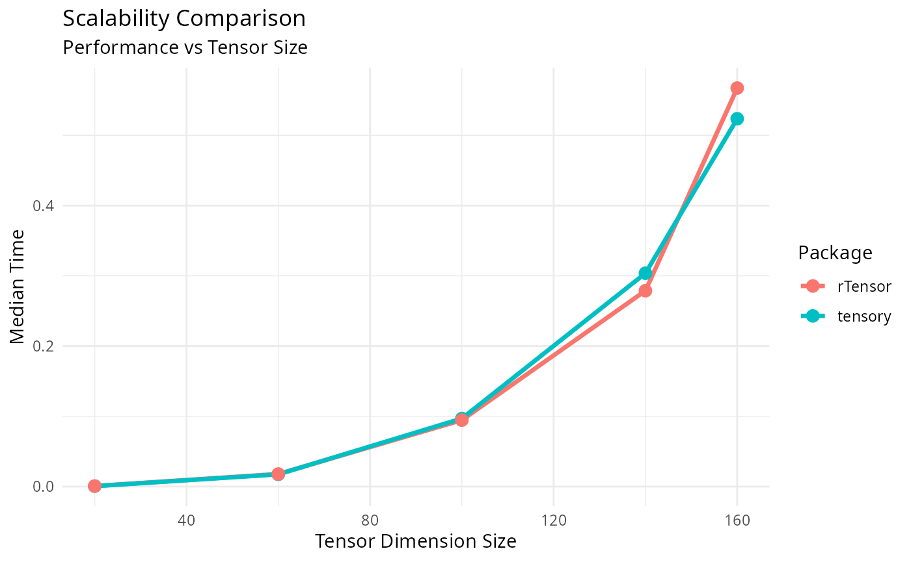

# performance

## Computational Efficiency: ttm vs rTensor

We compare the computational efficiency of the `ttm` function from the
`tensory` package with the equivalent function in the `rTensor` package.
This benchmark demonstrates the performance benefits of using `tensory`
for tensor-times-matrix multiplication.

``` r

set.seed(123)

# Create a random 3-mode tensor and a matrix
X <- array(runif(30*40*50), dim = c(30, 40, 50))
mat <- matrix(runif(20*40), nrow = 20, ncol = 40)

library(bench)

# Prepare rTensor object
X_rTensor <- rTensor::as.tensor(X)
X <- tensory::Tensor$new(X)

# Benchmark ttm in tensory vs rTensor
bm <- bench::mark(
  tensory = tensory::ttm(X, mat, mode = 2)$data,
  rTensor = rTensor::ttm(X_rTensor, mat, m = 2)@data,
  min_iterations = 50,
  check = FALSE
)
bm
#> # A tibble: 2 × 6
#>   expression      min   median `itr/sec` mem_alloc `gc/sec`
#>   <bch:expr> <bch:tm> <bch:tm>     <dbl> <bch:byt>    <dbl>
#> 1 tensory      1.79ms   1.85ms      507.   511.1KB     4.11
#> 2 rTensor      1.48ms    1.8ms      563.     1.2MB    15.4


# Visualization
library(ggplot2)
library(dplyr)
library(tidyr)
autoplot(bm, type = "violin")
```



``` r


bm %>%
  unnest(c(time, gc)) %>%
  filter(gc == "none") %>%
  mutate(expression = as.character(expression)) %>%
  ggplot(aes(x = mem_alloc, y = time, color = expression)) +
  geom_point() +
  scale_color_bench_expr(scales::brewer_pal(type = "qual", palette = 3))
```



``` r

set.seed(123)

# Create a random 3-mode tensor and a matrix
X <- array(runif(10*100*50), dim = c(10, 100, 50))
mat <- matrix(runif(100*100), nrow = 100, ncol = 100)

library(bench)

# Prepare rTensor object
X_rTensor <- rTensor::as.tensor(X)
X <- tensory::Tensor$new(X)

# Benchmark ttm in tensory vs rTensor
bm <- bench::mark(
  tensory = tensory::ttm(X, mat, mode = 2)$data,
  rTensor = rTensor::ttm(X_rTensor, mat, m = 2)@data,
  iterations = 50,
  check = FALSE
)
bm
#> # A tibble: 2 × 6
#>   expression      min   median `itr/sec` mem_alloc `gc/sec`
#>   <bch:expr> <bch:tm> <bch:tm>     <dbl> <bch:byt>    <dbl>
#> 1 tensory      3.73ms   4.43ms      229.  781.67KB     4.68
#> 2 rTensor      3.72ms   3.81ms      246.    1.53MB    10.2

# Visualization
library(ggplot2)
autoplot(bm, type = "violin")
```



## Multiple Matrix Multiplications Benchmark

Here we benchmark the performance of multiple matrix multiplications,
which is a common operation in tensor decomposition algorithms and
multilinear algebra.

``` r

set.seed(456)

# Create a 4-mode tensor and matrices for each mode
X3 <- array(runif(50*40*30*20), dim = c(50, 40, 30, 20))
matrices3 <- list(
  matrix(runif(6*50), nrow = 6, ncol = 50),  # mode 1
  matrix(runif(4*40), nrow = 4, ncol = 40),  # mode 2
  matrix(runif(3*30), nrow = 3, ncol = 30),  # mode 3
  matrix(runif(2*20), nrow = 2, ncol = 20)   # mode 4
)

library(bench)

# Prepare rTensor object
X3_rTensor <- rTensor::as.tensor(X3)
X3_tensor <- tensory::Tensor$new(X3)

# Define function for multiple rTensor ttm operations
multiple_ttm_rTensor <- function(tensor, mat_list) {
  result <- tensor
  for (i in seq_along(mat_list)) {
    result <- rTensor::ttm(result, mat_list[[i]], m = i)
  }
  return(result)
}

# Benchmark multiple ttm operations
bm_multiple <- bench::mark(
  tensory = tensory::ttm(X3_tensor, matrices3, mode = c(1, 2, 3, 4))$data,
  rTensor = multiple_ttm_rTensor(X3_rTensor, matrices3)@data,
  iterations = 50,
  check = FALSE
)
bm_multiple
#> # A tibble: 2 × 6
#>   expression      min   median `itr/sec` mem_alloc `gc/sec`
#>   <bch:expr> <bch:tm> <bch:tm>     <dbl> <bch:byt>    <dbl>
#> 1 tensory      12.5ms     13ms      74.1    1.08MB     4.73
#> 2 rTensor      15.5ms   15.8ms      61.9   14.07MB    61.9

# Visualization
library(ggplot2)
autoplot(bm_multiple, type = "violin")
```



``` r

set.seed(456)

# Create a 4-mode tensor and matrices for each mode
X <- array(runif(4^6), dim = rep(4,6))
a <- matrix(runif(4*4), nrow = 4, ncol = 4)
matrices <- lapply(1:6,function(xx) a)

library(bench)

# Prepare rTensor object
X_rTensor <- rTensor::as.tensor(X)
X <- tensory::Tensor$new(X)

# Define function for multiple rTensor ttm operations
multiple_ttm_rTensor <- function(tensor, mat_list) {
  result <- tensor
  for (i in seq_along(mat_list)) {
    result <- rTensor::ttm(result, mat_list[[i]], m = i)
  }
  return(result)
}

# Benchmark multiple ttm operations
bm_multiple <- bench::mark(
  tensory = tensory::ttm(X, matrices, mode = 1:6)$data,
  rTensor = multiple_ttm_rTensor(X_rTensor, matrices)@data,
  iterations = 10,
  check = FALSE
)
bm_multiple
#> # A tibble: 2 × 6
#>   expression      min   median `itr/sec` mem_alloc `gc/sec`
#>   <bch:expr> <bch:tm> <bch:tm>     <dbl> <bch:byt>    <dbl>
#> 1 tensory      1.16ms    1.2ms      821.     225KB        0
#> 2 rTensor       2.4ms    2.5ms      388.     773KB        0

# Visualization
library(ggplot2)
autoplot(bm_multiple, type = "violin")
```



## Memory Efficiency Comparison

Let’s also compare memory usage during these operations:

``` r

set.seed(789)

# Create a tensor and matrix for memory comparison
X <- array(runif(30*25*20), dim = c(30, 25, 20))
mat <- matrix(runif(35*25), nrow = 35, ncol = 25)

library(bench)

# Prepare rTensor object
X_rTensor <- rTensor::as.tensor(X)
X <- tensory::Tensor$new(X)

# Memory benchmark
bm_memory <- bench::mark(
  tensory = tensory::ttm(X, mat, mode = 2)$data,
  rTensor = rTensor::ttm(X_rTensor, mat, m = 2)@data,
  iterations = 20,
  check = FALSE
)
bm_memory
#> # A tibble: 2 × 6
#>   expression      min   median `itr/sec` mem_alloc `gc/sec`
#>   <bch:expr> <bch:tm> <bch:tm>     <dbl> <bch:byt>    <dbl>
#> 1 tensory       850µs    892µs     1114.     329KB      0  
#> 2 rTensor       960µs    995µs      991.     610KB     52.1

# Visualization
library(ggplot2)
autoplot(bm_memory, type = "violin")
```



## Scalability Analysis

Finally, let’s analyze how performance scales with tensor size:

``` r

set.seed(101112)

# Test different tensor sizes
sizes <- c(20, 60, 100, 140, 160)
scalability_results <- data.frame()

library(bench)

for (size in sizes) {
  # Create tensor of varying size
  X <- array(runif(size^3), dim = c(size, size, size))
  mat <- matrix(runif((size) * size), nrow = size, ncol = size)

  # Prepare rTensor object
  X_rTensor <- rTensor::as.tensor(X)
  X <- tensory::Tensor$new(X)

  # Benchmark
  bm_scale <- bench::mark(
    tensory = tensory::ttm(X, mat, mode = 2)$data,
    rTensor = rTensor::ttm(X_rTensor, mat, m = 2)@data,
    iterations = 20,
    check = FALSE
  )

  # Store results
  temp_results <- data.frame(
    size = size,
    package = as.character(bm_scale$expression),
    median_time = as.numeric(bm_scale$median),
    memory = as.numeric(bm_scale$mem_alloc)
  )

  scalability_results <- rbind(scalability_results, temp_results)
}

# Visualization
library(ggplot2)
ggplot(scalability_results, aes(x = size, y = median_time, color = package)) +
  geom_line(size = 1.2) +
  geom_point(size = 3) +
  #scale_y_log10() +
  labs(title = "Scalability Comparison",
       subtitle = "Performance vs Tensor Size",
       x = "Tensor Dimension Size",
       y = "Median Time",
       color = "Package") +
  theme_minimal()
```



``` r

set.seed(101112)

# Test different tensor sizes
sizes <- c(20, 60, 100, 140, 160)
scalability_results <- data.frame()

library(bench)

for (size in sizes) {
  # Create tensor of varying size
  X <- array(runif(size*size*size), dim = c(size, size, size))
  mat <- matrix(runif((size+10) * size), nrow = size+10, ncol = size)

  # Prepare rTensor object
  X_rTensor <- rTensor::as.tensor(X)
  X <- tensory::Tensor$new(X)

  # Benchmark
  bm_scale <- bench::mark(
    tensory = tensory::ttm(X, mat, mode = 3)$data,
    rTensor = rTensor::ttm(X_rTensor, mat, m = 3)@data,
    iterations = 10,
    check = FALSE
  )

  # Store results
  temp_results <- data.frame(
    size = size,
    package = as.character(bm_scale$expression),
    median_time = as.numeric(bm_scale$median),
    mean_time = as.numeric(bm_scale$total_time/bm_scale$n_itr),
    memory = as.numeric(bm_scale$mem_alloc)
  )

  scalability_results <- rbind(scalability_results, temp_results)
}

# Visualization
library(ggplot2)
ggplot(scalability_results, aes(x = size, y = mean_time, color = package)) +
  geom_line(size = 1.2) +
  geom_point(size = 3) +
  #scale_y_log10() +
  labs(title = "Scalability Comparison",
       subtitle = "Performance vs Tensor Size",
       x = "Tensor Dimension Size",
       y = "Median Time",
       color = "Package") +
  theme_minimal()
```


