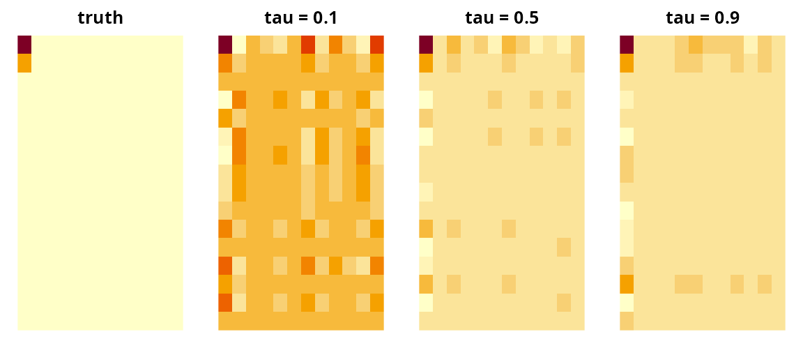

# Quantile Regression with Tensor Predictors: pqtr()

``` r

library(tensory)
#> 
#> Attaching package: 'tensory'
#> The following object is masked from 'package:stats':
#> 
#>     reshape
#> The following object is masked from 'package:utils':
#> 
#>     find
#> The following object is masked from 'package:methods':
#> 
#>     kronecker
#> The following objects are masked from 'package:base':
#> 
#>     %*%, kronecker, scale
```

## The problem this solves

Each subject contributes a whole **array** — an image, a
region-by-region connectivity matrix, a sensor-by-time grid — and one
continuous outcome. Mean regression asks how the array moves the
*average* outcome.
[`pqtr()`](https://www.sundayu.me/tensory/reference/pqtr.md) asks how it
moves a particular quantile.

The two questions come apart whenever the interesting subjects are not
the average ones. A brain region may barely shift mean cognitive score
while strongly predicting who ends up in the bottom decile. A predictor
may leave the median alone and widen the spread. Mean regression sees
neither effect; fitting `tau = 0.1` and `tau = 0.9` and comparing the
two coefficient arrays does.

Quantile regression also makes no assumption about the error
distribution and is unmoved by outliers in the outcome, which is worth
having on its own when the response is skewed or heavy-tailed.

The obstacle is size. A 32 x 32 image is 1,024 predictors; with 200
subjects the flattened quantile regression has no unique solution, and
flattening also throws away the grid — it forgets that row 4 column 12
sits next to row 4 column 13.
[`pqtr()`](https://www.sundayu.me/tensory/reference/pqtr.md) keeps the
grid, compressing each *dimension* of the array separately into a few
directions chosen for their association with the quantile of interest,
then mapping the answer back to the original shape.

**Which function do I want?**

|  | [`pqtr()`](https://www.sundayu.me/tensory/reference/pqtr.md) | [`tepls()`](https://www.sundayu.me/tensory/reference/tepls.md) | [`spgtr()`](https://www.sundayu.me/tensory/reference/spgtr.md) |
|----|----|----|----|
| Models | a quantile of the outcome | the mean | a GLM mean (any family) |
| Outcome | continuous | continuous, one or several | binary, count, continuous, … |
| Extra covariates | yes, unreduced | no | yes, unpenalized |
| Selects whole slices | no | no | yes, via an L2,1 penalty |
| Robust to outliers | yes | no | no |

## How to lay out your data

Two forms are accepted, and they are interchangeable.

**A list, one array per subject.** Every element must have the same
dimensions.

``` r

set.seed(1)
p <- c(16, 12)
n <- 300
X <- lapply(seq_len(n), function(i) matrix(rnorm(prod(p)), p[1], p[2]))
length(X)
#> [1] 300
dim(X[[1]])
#> [1] 16 12
```

**One big array with subjects in the *last* mode.** Data that already
arrives as a `16 x 12 x 300` block can be handed over directly.

``` r

Xbig <- array(unlist(X), dim = c(p, n))
dim(Xbig)
#> [1]  16  12 300
```

The outcome is a numeric vector of length `n`. Unlike
[`tepls()`](https://www.sundayu.me/tensory/reference/tepls.md), one
outcome at a time — a quantile is defined for a scalar.

## Quick start

The signal below sits in the top-left corner of the image, and the noise
grows with it. The corner shifts the median and shifts the upper tail by
more, so the coefficient array depends on which quantile is asked for.

``` r

B_true <- outer(c(2, 1, rep(0, p[1] - 2)), c(1.5, rep(0, p[2] - 1)))
signal <- vapply(X, function(xi) sum(B_true * xi), numeric(1))
y <- signal + 0.4 * (1 + 0.8 * (signal - min(signal))) * rnorm(n)

med <- pqtr(X, y, tau = 0.5)
med
#> <pqtr: partial quantile tensor regression>
#> Quantile (tau):  0.5 
#> Subjects:        300 
#> Array shape:     16 x 12 
#> Directions (u):  1 1 (1 latent score) 
#> Covariates (Z):  0 
#> Check loss:      423.395
```

`u` was not supplied, so
[`pqtr()`](https://www.sundayu.me/tensory/reference/pqtr.md) chose the
number of directions per mode. The coefficient is an array of the same
shape as one subject’s data:

``` r

B_med <- as.tensor(coef(med))$as_array()
dim(B_med)
#> [1] 16 12
round(B_med[1:4, 1:4], 2)
#>       [,1]  [,2]  [,3]  [,4]
#> [1,]  2.54 -0.17  0.36 -0.01
#> [2,]  0.77 -0.05  0.11  0.00
#> [3,] -0.14  0.01 -0.02  0.00
#> [4,] -0.64  0.04 -0.09  0.00
```

The same data at three quantiles, with `u` fixed so the three fits are
compared on equal terms:

``` r

fits <- lapply(c(0.1, 0.5, 0.9), function(t) pqtr(X, y, tau = t, u = c(1, 1)))
names(fits) <- c("tau = 0.1", "tau = 0.5", "tau = 0.9")
vapply(fits, function(f) sqrt(sum(f$bvec^2)), numeric(1))
#> tau = 0.1 tau = 0.5 tau = 0.9 
#>  1.749349  3.234018  3.685464
```

The coefficient grows moving up the distribution, which is how the data
were generated:

``` r

op <- par(mfrow = c(1, 4), mar = c(1, 1, 2, 1))
image(t(B_true[p[1]:1, ]), main = "truth", axes = FALSE)
for (nm in names(fits)) {
  image(t(as.tensor(coef(fits[[nm]]))$as_array()[p[1]:1, ]), main = nm,
        axes = FALSE)
}
```



``` r

par(op)
```

Predictions are fitted **conditional quantiles**, not conditional means:

``` r

q10 <- predict(fits[["tau = 0.1"]])
q90 <- predict(fits[["tau = 0.9"]])
c(below_q10 = mean(y < q10), below_q90 = mean(y < q90))
#> below_q10 below_q90 
#>       0.1       0.9
```

About 10% of subjects fall below the fitted 10th percentile and about
90% below the fitted 90th; minimizing the check loss forces that
calibration in sample.

The gap between the two is a prediction interval for a new subject, one
that widens where the model says the outcome is more variable:

``` r

width <- q90 - q10
summary(width)
#>    Min. 1st Qu.  Median    Mean 3rd Qu.    Max. 
#>   1.253   7.637  10.088  10.039  12.301  22.785
```

## Choosing the number of directions

`u` is the one knob: how many directions to keep in each mode.
`u = c(1, 1)` keeps one row-pattern and one column-pattern;
`u = c(3, 2)` keeps three and two. Larger `u` means a more flexible fit,
with `prod(u)` latent scores fed to the quantile regression.

Left at its default `NULL`,
[`pqtr()`](https://www.sundayu.me/tensory/reference/pqtr.md) uses an
eigenvalue-ratio rule: for each mode it takes the largest gap between
consecutive eigenvalues of that mode’s signal matrix, searching a few
candidates.

``` r

med$u
#> [1] 1 1
```

When you know the structure, say so — a scalar is recycled across modes:

``` r

pqtr(X, y, tau = 0.5, u = c(1, 1))$u
#> [1] 1 1
pqtr(X, y, tau = 0.5, u = 2)$u
#> [1] 2 2
```

Otherwise cross-validate.
[`pqtr_cv()`](https://www.sundayu.me/tensory/reference/pqtr_cv.md)
scores a grid by out-of-fold check loss and returns the model refitted
at the winner:

``` r

set.seed(2)
cv <- pqtr_cv(X, y, tau = 0.5, u_grid = 1:4, nfolds = 5)
cv$cv
#>       u      loss
#> 1 1 x 1  95.07699
#> 2 2 x 2  97.52210
#> 3 3 x 3  98.54563
#> 4 4 x 4 102.36129
cv$u_min
#> [1] 1 1
```

The default grid keeps the same number of directions in every mode. To
let the modes differ, pass the candidates yourself:

``` r

grid <- list(c(1, 1), c(2, 1), c(1, 2), c(2, 2))
pqtr_cv(X, y, tau = 0.5, u_grid = grid, nfolds = 3)$u_min
#> [1] 1 2
```

Prefer the smallest `u` within noise of the best: extra directions cost
parameters in the quantile regression and start fitting noise.

## Covariates that should not be reduced

Age, sex, batch, scanner — variables to adjust for but not compress — go
in `Z`. They enter the model unreduced, and they also enter the
dimension reduction, where the outcome is replaced by its working
residual from a quantile regression on `Z` alone. The extracted
directions therefore describe the part of the array not already
explained by the covariates.

``` r

Z <- cbind(age = rnorm(n), male = rbinom(n, 1, 0.5))
y_adj <- y + Z %*% c(2, -1)

fit_z <- pqtr(X, as.vector(y_adj), tau = 0.5, Z = Z, u = c(1, 1))
round(fit_z$gamma, 2)
#> [1]  1.46 -0.93
```

[`predict()`](https://rdrr.io/r/stats/predict.html) then needs the new
covariates as well:

``` r

head(predict(fit_z, X[1:5], Z[1:5, , drop = FALSE]))
#> [1] -2.3004607 -0.8216495  4.5374452  4.6204792 -0.7537684
```

## What is in the fit

``` r

names(med)
#>  [1] "coef"      "core"      "W"         "alpha"     "gamma"     "bvec"     
#>  [7] "scores"    "dims"      "u"         "tau"       "q"         "n"        
#> [13] "Xbar"      "Zbar"      "Sig"       "U"         "fitted"    "residuals"
#> [19] "y"         "loss"
```

- `coef` — the coefficient array as a `TTensor`, with core `core` and
  weight matrices `W`. `coef(fit)` returns it; `as.tensor(coef(fit))`
  expands it to a dense array; `fit$bvec` is the same thing flattened.
- `W` — one matrix per mode, `p_k x u[k]`, whose columns are the
  directions kept in that mode. These have orthonormal columns.
- `alpha`, `gamma` — intercept and covariate coefficients, on the
  centered scale ([`predict()`](https://rdrr.io/r/stats/predict.html)
  handles the centering for you).
- `u`, `dims`, `tau`, `n` — the shape of the problem.
- `fitted`, `residuals`, `loss` — fitted conditional quantiles, their
  residuals, and the attained check loss.
- `scores` — the `n x prod(u)` compressed coordinates, useful for
  plotting or as input to another model.

The per-mode directions are interpretable on their own. The first mode’s
direction should concentrate on rows 1 and 2 and the second mode’s on
column 1:

``` r

round(med$W[[1]][1:4, 1, drop = FALSE], 3)
#>        [,1]
#> [1,]  0.834
#> [2,]  0.253
#> [3,] -0.047
#> [4,] -0.211
round(med$W[[2]][1:4, 1, drop = FALSE], 3)
#>        [,1]
#> [1,]  0.942
#> [2,] -0.063
#> [3,]  0.135
#> [4,] -0.004
```

## Out-of-sample check loss

In-sample calibration is guaranteed by construction, so it proves
nothing. Hold data out and score with the same check loss the method
minimizes: for a fitted quantile `q`, the loss on a new subject is
`(y - q) * (tau - 1{y < q})`.

``` r

set.seed(3)
tr <- sample(n, 200)
te <- setdiff(seq_len(n), tr)
check <- function(r, tau) mean(r * (tau - (r < 0)))

f <- pqtr(X[tr], y[tr], tau = 0.5, u = c(1, 1))
c(in_sample  = check(y[tr] - predict(f), 0.5),
  out_sample = check(y[te] - predict(f, X[te]), 0.5))
#>  in_sample out_sample 
#>   1.351274   1.811210
```

A useful baseline is the constant fit, which ignores the array entirely:

``` r

check(y[te] - median(y[tr]), 0.5)
#> [1] 2.148916
```

[`predict()`](https://rdrr.io/r/stats/predict.html) accepts new data in
either input form and checks the dimensions:

``` r

identical(predict(f, X[te]),
          predict(f, array(unlist(X[te]), dim = c(p, length(te)))))
#> [1] TRUE
try(predict(f, lapply(1:5, function(i) matrix(0, 3, 3))))
#> Error in predict.pqtr(f, lapply(1:5, function(i) matrix(0, 3, 3))) : 
#>   newX dimensions must match the fitted predictor dimensions.
```

## How it works

[`pqtr()`](https://www.sundayu.me/tensory/reference/pqtr.md) implements
the algorithm of Sun et al. (2024). The outcome enters the dimension
reduction only through its working residual from a quantile regression
on `Z` alone (the sample quantile when `Z` is absent); each mode of the
array is compressed to a few directions associated with that residual,
the quantile regression is refitted on the compressed predictor together
with the covariates, and the reduced coefficient is expanded back to the
shape of the original array. No `prod(p) x prod(p)` matrix is inverted,
only the per-mode `p_k x p_k` ones, which is why the number of subjects
can be far smaller than the number of cells in the array. Only the
dimension reduction is approximate: the final fit is an exact linear
quantile regression on the scores. Sun et al. (2024) give the
derivation.

**Relation to the reference implementation.**
[`pqtr()`](https://www.sundayu.me/tensory/reference/pqtr.md) is a port
of the MATLAB code released with the paper
(<https://github.com/dayusun/PQTR>), with deliberate differences.

- The inner quantile regressions use the MM algorithm of Hunter & Lange
  (2000), whose surrogate is matched to the check loss, rather than
  MATLAB’s `fminunc`, a smooth solver applied to a non-smooth objective.
- The predictor is centered before the latent scores are formed. This
  changes what `alpha` means — it is now the intercept at the training
  means — but leaves the coefficient array identical.
- Cross-validated selection lives in
  [`pqtr_cv()`](https://www.sundayu.me/tensory/reference/pqtr_cv.md),
  which takes an explicit grid instead of enumerating every combination
  of per-mode dimensions; the default grid uses one common dimension,
  and anything else can be passed by hand.
- The eigenvalue-ratio rule searches at most five candidate dimensions
  per mode instead of about `sqrt(n)` of them. Past the rank of the
  signal matrix the eigenvalues are noise, and the largest ratio among
  them wins: on the data above the wider search returns `u = c(12, 11)`,
  which is 132 latent scores from 300 subjects. This is the same cap
  [`spgtr()`](https://www.sundayu.me/tensory/reference/spgtr.md) and
  [`tepls()`](https://www.sundayu.me/tensory/reference/tepls.md) use.

The deflation follows the reference code: the oblique projector
`I - Sigma_k W (W' Sigma_k W)^-1 W'`, which leaves the weight matrices
with orthonormal columns. It is *not* the SIMPLS deflation used by
[`tepls()`](https://www.sundayu.me/tensory/reference/tepls.md) and
[`spgtr()`](https://www.sundayu.me/tensory/reference/spgtr.md), which
instead makes the latent scores uncorrelated. The two coincide when the
signal matrix has rank one and differ otherwise.

## References

Sun, D., Qiu, Z., Peng, L., Guo, Y. and Manatunga, A. (2024). Partial
quantile tensor regression. *Journal of the American Statistical
Association* **120**(551), 1724–1735.
<doi:10.1080/01621459.2024.2422129>

Hunter, D. R. and Lange, K. (2000). Quantile regression via an MM
algorithm. *Journal of Computational and Graphical Statistics* **9**(1),
60–77.
