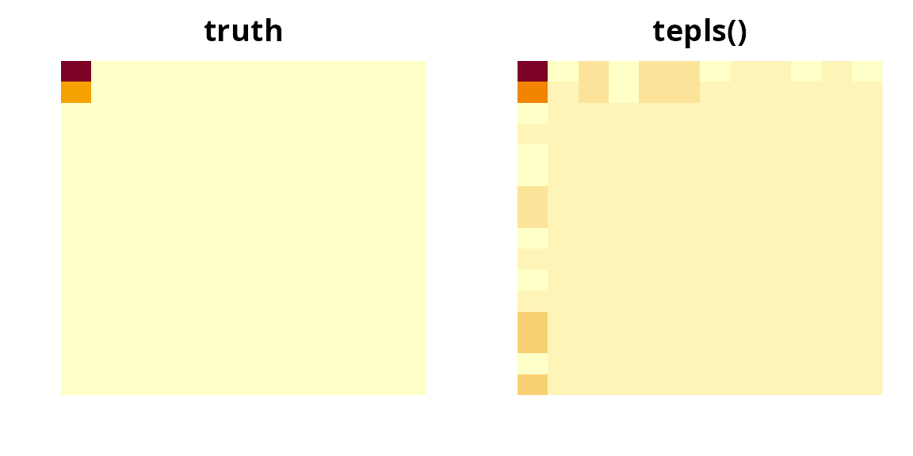

# Tensor PLS Regression with tepls()

``` r

library(tensory)
#> 
#> Attaching package: 'tensory'
#> The following object is masked from 'package:stats':
#> 
#>     reshape
#> The following object is masked from 'package:utils':
#> 
#>     find
#> The following object is masked from 'package:methods':
#> 
#>     kronecker
#> The following objects are masked from 'package:base':
#> 
#>     %*%, kronecker, scale
```

## The problem this solves

Each subject contributes a whole **array** — an image, a
region-by-region connectivity matrix, a sensor-by-time grid — and one or
more **continuous** outcomes. You want to predict the outcome from the
array.

Flattening the array and calling
[`lm()`](https://rdrr.io/r/stats/lm.html) does not work. A 32 × 32 image
is 1,024 predictors; with 200 subjects there is no unique least-squares
solution, and whatever a solver returns is fitting noise. Flattening
also discards the grid: it forgets that row 4 column 12 sits beside row
4 column 13.

[`tepls()`](https://www.sundayu.me/tensory/reference/tepls.md) keeps the
grid. It compresses each *dimension* of the array separately into a few
informative directions, regresses the outcome on the compressed array,
and then maps the answer back so the coefficient has the same shape as
your data. A 32 × 32 predictor reduced to 2 directions per mode leaves 4
numbers to estimate instead of 1,024.

**[`tepls()`](https://www.sundayu.me/tensory/reference/tepls.md) or
[`spgtr()`](https://www.sundayu.me/tensory/reference/spgtr.md)?**

|  | [`tepls()`](https://www.sundayu.me/tensory/reference/tepls.md) | [`spgtr()`](https://www.sundayu.me/tensory/reference/spgtr.md) |
|----|----|----|
| Outcome | continuous; several at once is fine | any GLM family (binary, count, …) |
| Extra covariates | no | yes, unpenalized |
| Selects whole slices | no | yes, via an L2,1 penalty |
| Cost | one closed-form pass | iterative |

For a continuous outcome and no covariates the two agree exactly when
[`spgtr()`](https://www.sundayu.me/tensory/reference/spgtr.md) is given
`family = gaussian()` and `basis = "simpls"`; a check at the end of this
article confirms it. Reach for
[`tepls()`](https://www.sundayu.me/tensory/reference/tepls.md) when that
is your setting — it is the cheaper, more direct route — and for
[`spgtr()`](https://www.sundayu.me/tensory/reference/spgtr.md) when you
need a non-Gaussian outcome, nuisance covariates, or slice selection.

## How to lay out your data

Two forms are accepted, and they are interchangeable.

**A list, one array per subject.** The most natural form. Every element
must have the same dimensions.

``` r

set.seed(1)
p <- c(16, 12)
X <- lapply(1:150, function(i) matrix(rnorm(prod(p)), p[1], p[2]))
length(X)
#> [1] 150
dim(X[[1]])
#> [1] 16 12
```

**One big array with subjects in the *last* mode.** If your data already
arrives as a `16 x 12 x 150` block, hand it over directly — no
reshaping.

``` r

Xbig <- array(unlist(X), dim = c(p, 150))
dim(Xbig)
#> [1]  16  12 150
```

The response is a numeric vector of length `n`, or an `n x r` matrix if
you have several outcomes per subject.

## Quick start

We plant a signal in the top-left corner of the image: the outcome
depends on the array through a single rank-one pattern, plus noise.

``` r

B_true <- outer(c(2, 1, rep(0, p[1] - 2)), c(1.5, rep(0, p[2] - 1)))
y <- vapply(X, function(xi) sum(B_true * xi), numeric(1)) + rnorm(150, sd = 0.5)

fit <- tepls(X, y)
fit
#> <tepls: tensor envelope PLS regression>
#> Predictor dims:  16 x 12 
#> Envelope dims (u):  1 1 
#> Response dim (r):  1
```

That is the whole call. `u` was not supplied, so
[`tepls()`](https://www.sundayu.me/tensory/reference/tepls.md) chose the
number of directions per mode for you. The estimated coefficient is an
array of the same shape as a subject’s data:

``` r

B_hat <- as.tensor(coef(fit))$as_array()
dim(B_hat)
#> [1] 16 12
round(B_hat[1:4, 1:4], 2)
#>       [,1]  [,2]  [,3]  [,4]
#> [1,]  2.06 -0.15  0.22 -0.32
#> [2,]  0.99 -0.07  0.11 -0.15
#> [3,] -0.17  0.01 -0.02  0.03
#> [4,] -0.08  0.01 -0.01  0.01
```

Only the corner is large, which is where we put the signal. A picture
makes the point faster than the numbers:

``` r

op <- par(mfrow = c(1, 2), mar = c(2, 2, 2, 1))
image(t(B_true[p[1]:1, ]), main = "truth", axes = FALSE)
image(t(B_hat[p[1]:1, ]), main = "tepls()", axes = FALSE)
```



``` r

par(op)
```

Predictions come from
[`predict()`](https://rdrr.io/r/stats/predict.html), with no `newdata`
returning the fitted values:

``` r

pred <- predict(fit)
cor(pred, y)^2
#> [1] 0.8474722
```

## Choosing the number of directions

`u` is the one knob: how many directions to keep in each mode.
`u = c(1, 1)` keeps one row-pattern and one column-pattern (a rank-one
coefficient); `u = c(3, 2)` keeps three and two. Larger `u` means a more
flexible fit and more parameters — `prod(u)` of them.

Left at its default `NULL`,
[`tepls()`](https://www.sundayu.me/tensory/reference/tepls.md) picks
each mode’s value from the largest gap between consecutive eigenvalues
of that mode’s signal matrix — the same rule
[`spgtr()`](https://www.sundayu.me/tensory/reference/spgtr.md) uses. It
is fast and usually sensible:

``` r

fit$u
#> [1] 1 1
```

When you know the structure, say so:

``` r

tepls(X, y, u = c(1, 1))$u
#> [1] 1 1
tepls(X, y, u = 2)$u # a scalar is recycled across modes
#> [1] 2 2
```

When you do not, cross-validate. There is no `tepls_cv()`; the fit is
cheap enough that an explicit loop is clearer than a wrapper:

``` r

cv_tepls <- function(X, y, u, nfolds = 5) {
  n <- length(X)
  fold <- sample(rep_len(seq_len(nfolds), n))
  err <- vapply(seq_len(nfolds), function(f) {
    tr <- which(fold != f)
    te <- which(fold == f)
    mean((predict(tepls(X[tr], y[tr], u = u), X[te]) - y[te])^2)
  }, numeric(1))
  mean(err)
}

set.seed(2)
grid <- list(c(1, 1), c(2, 1), c(2, 2), c(3, 3))
data.frame(
  u   = vapply(grid, paste, character(1), collapse = " x "),
  mse = vapply(grid, function(u) cv_tepls(X, y, u), numeric(1))
)
#>       u      mse
#> 1 1 x 1 2.935611
#> 2 2 x 1 3.136265
#> 3 2 x 2 2.962494
#> 4 3 x 3 3.145656
```

The prediction error is flat once `u` is large enough to hold the signal
and climbs as extra directions start fitting noise. Prefer the smallest
`u` within noise of the best.

## Several outcomes at once

Pass a matrix response and every column is fit jointly, sharing one set
of per-mode directions. The coefficient gains a trailing mode, one slice
per outcome.

``` r

Y <- cbind(
  y,
  vapply(X, function(xi) sum((2 * B_true) * xi), numeric(1)) + rnorm(150, sd = 0.5)
)
mfit <- tepls(X, Y, u = c(1, 1))
mfit$r
#> [1] 2
dim(as.tensor(coef(mfit))$as_array())
#> [1] 16 12  2
dim(predict(mfit))
#> [1] 150   2
```

Sharing the directions is the point: the two outcomes here are driven by
the same image pattern, and fitting them together estimates that pattern
from twice the data.

## What is in the fit

``` r

names(fit)
#> [1] "coef"      "W"         "intercept" "Xbar"      "dims"      "u"        
#> [7] "r"         "fitted"
```

- `coef` — the coefficient `Tensor`, in the shape of your predictor
  (with a trailing response mode when there is more than one outcome).
  Also reachable as `coef(fit)`.
- `W` — one matrix per mode, `p_k x u[k]`, whose columns are the
  directions kept in that mode. These are what the method learns.
- `u`, `dims`, `r` — the shape of the problem.
- `intercept`, `Xbar` — the response mean and the predictor mean used
  for centering; [`predict()`](https://rdrr.io/r/stats/predict.html)
  needs both.
- `fitted` — in-sample predictions.

The per-mode directions are interpretable on their own. Here the first
mode’s direction should be concentrated on rows 1 and 2, and the second
mode’s on column 1:

``` r

round(fit$W[[1]][1:4, 1, drop = FALSE], 3)
#>        [,1]
#> [1,]  0.835
#> [2,]  0.400
#> [3,] -0.070
#> [4,] -0.033
round(fit$W[[2]][1:4, 1, drop = FALSE], 3)
#>        [,1]
#> [1,]  0.958
#> [2,] -0.070
#> [3,]  0.102
#> [4,] -0.147
```

Subjects’ compressed coordinates — the *latent scores* — are the
centered predictor projected onto those directions — `prod(u)` numbers
per subject, so just one apiece here. They are useful for plotting or as
input to another model:

``` r

scores <- vapply(X, function(xi) {
  as.vector(crossprod(fit$W[[1]], (xi - matrix(fit$Xbar, p[1], p[2]))) %*% fit$W[[2]])
}, numeric(prod(fit$u)))
str(scores)
#>  num [1:150] -1.131 -0.85 2.151 1.72 -0.459 ...
```

## Evaluating honestly

In-sample `R^2` is optimistic. Hold data out.

``` r

set.seed(3)
tr <- sample(150, 100)
te <- setdiff(1:150, tr)

f <- tepls(X[tr], y[tr], u = c(1, 1))
oos <- predict(f, X[te])

c(in_sample  = cor(predict(f), y[tr])^2,
  out_sample = cor(oos, y[te])^2)
#>  in_sample out_sample 
#>  0.8230258  0.7387680
```

[`predict()`](https://rdrr.io/r/stats/predict.html) accepts new data in
either input form, and checks that its dimensions match the fit:

``` r

identical(oos, predict(f, array(unlist(X[te]), dim = c(p, length(te)))))
#> [1] TRUE
try(predict(f, lapply(1:5, function(i) matrix(0, 3, 3))))
#> Error in predict.tepls(f, lapply(1:5, function(i) matrix(0, 3, 3))) : 
#>   newX dimensions must match the fitted predictor dimensions.
```

## How it works

[`tepls()`](https://www.sundayu.me/tensory/reference/tepls.md)
implements Algorithm 4 of Zhang & Li (2017).

1.  **Center** the predictor and response.
2.  **Marginal covariances.** For each mode `k`, `Sigma_k` averages
    `X_(k) X_(k)'` over subjects — how variable the array is along that
    mode. (This step runs in C++ when the compiled kernel is available.)
3.  **Cross-covariance.** `C` is the array of covariances between each
    predictor cell and the response — where the signal is.
4.  **Per-mode signal matrix.**
    `M_k = C_(k) (kron_{j != k} Sigma_j^-1) C_(k)'` standardizes `C`
    along every mode but `k`, so `M_k` measures signal in mode `k` after
    accounting for the others.
5.  **SIMPLS deflation.** The leading eigenvector of `M_k` is the first
    direction; project it out (in the `Sigma_k` metric) and repeat,
    `u[k]` times. This gives `W_k`.
6.  **Reduced regression.** Project every subject onto
    `W_1 kron ... kron W_m` and regress the response on the resulting
    `prod(u)` scores by least squares.
7.  **Map back.** `B = W (reduced coefficient)`, reshaped to the
    predictor’s shape (their Lemma 2).

Nothing here is iterative, and nothing inverts a `prod(p) x prod(p)`
matrix — only the per-mode `p_k x p_k` ones. That is why `n` can be far
smaller than `prod(p)`.

**Relation to the reference implementation.** The mode-`k` second-moment
matrix built in step 4 is identical to the `U U'` matrix in
`TEReg::TensPLS_fit`. Two deliberate divergences: that package estimates
each mode’s basis with an envelope (`EnvMU`) optimizer, whereas
[`tepls()`](https://www.sundayu.me/tensory/reference/tepls.md) runs the
SIMPLS deflation of Algorithm 4 exactly; and the reduced regression here
is plain least squares on the latent scores (Step 6), which is invariant
to the scale ambiguity of the separable covariance, so no Kronecker
scale needs pinning.

## Two identities worth knowing

**Keeping every direction is ordinary least squares.** With `u = p`
nothing is discarded, and the fit must coincide with
[`lm()`](https://rdrr.io/r/stats/lm.html) on the flattened predictor:

``` r

set.seed(4)
ps <- c(3, 2)
Xs <- lapply(1:200, function(i) matrix(rnorm(prod(ps)), ps[1], ps[2]))
ys <- vapply(Xs, function(xi) sum(xi[1:2]), numeric(1)) + rnorm(200, sd = 0.2)

full <- tepls(Xs, ys, u = ps)
ols <- lm(ys ~ t(vapply(Xs, as.vector, numeric(prod(ps)))))
max(abs(as.vector(as.tensor(coef(full))$as_array()) - unname(coef(ols)[-1])))
#> [1] 5.434164e-11
```

**[`spgtr()`](https://www.sundayu.me/tensory/reference/spgtr.md) with a
Gaussian family and the SIMPLS basis is the same model.**

``` r

a <- tepls(X, y, u = c(2, 2))
b <- spgtr(X, y, u = c(2, 2), family = gaussian(), basis = "simpls")
max(abs(as.vector(as.tensor(coef(a))$as_array()) - b$bvec))
#> [1] 9.763435e-11
```

If either identity ever breaks, something is wrong with the centering,
the score map, or the reconstruction — both are in the test suite for
that reason.

## Limits

- **Continuous outcomes only.** Binary or count outcomes belong in
  [`spgtr()`](https://www.sundayu.me/tensory/reference/spgtr.md).
- **No covariates.** Age, sex, batch and the like cannot be entered
  unpenalized;
  [`spgtr()`](https://www.sundayu.me/tensory/reference/spgtr.md)’s `Z`
  argument does that.
- **No sparsity.** Every row and column of the array contributes. When
  you need “which slices matter”, use
  [`spgtr()`](https://www.sundayu.me/tensory/reference/spgtr.md) with
  `lambda > 0`.
- **No standard errors.** The coefficient is a point estimate. Bootstrap
  the subjects if you need uncertainty.
- **`u` is not free.** Choose it by cross-validation when the
  eigenvalue-gap default is not obviously right — with `prod(u)`
  parameters, a too-large `u` overfits like any other model.

## Reference

Zhang, X. and Li, L. (2017). Tensor envelope partial least-squares
regression. *Technometrics* **59**(4), 426–436.
